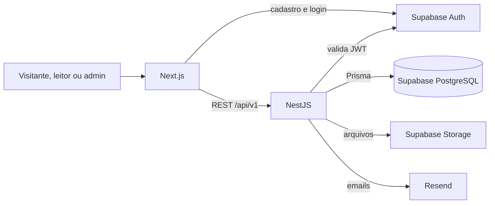

# Vavito Archives

Monorepo do Vavito Archives, composto pela API NestJS, pela aplicação web Next.js e por pacotes compartilhados.

## Requisitos

- Node.js 24 LTS (a versão recomendada está em `.nvmrc` e `.node-version`)
- Corepack habilitado
- Projeto Supabase com PostgreSQL e Auth para executar a API completa
- Conta Resend para demonstrar emails de contato e newsletter

## Instalação

```bash
corepack enable
corepack install
pnpm install
```

O projeto usa um único `pnpm-lock.yaml`, mantido na raiz.

Crie o arquivo local de ambiente antes de iniciar a API:

```bash
cp .env.example .env
```

No PowerShell, use `Copy-Item .env.example .env`. O arquivo `.env` não deve ser versionado e os placeholders devem ser substituídos por credenciais reais apenas no ambiente apropriado.

Crie também o ambiente local do frontend:

```bash
cp apps/web/.env.example apps/web/.env.local
```

No PowerShell, use `Copy-Item apps/web/.env.example apps/web/.env.local`. As variáveis públicas definem as origens HTTP da API e do Supabase, além da publishable key. Elas não devem conter segredos ou a `service_role`.

Para executar a API completa:

1. configure PostgreSQL, Auth e Storage no Supabase;
2. configure os remetentes e a API key do Resend;
3. aplique as migrations com `pnpm --filter @vavito/api prisma:migrate:deploy`;
4. crie um usuário confirmado e execute o seed administrativo conforme `docs/development/database.md`;
5. inicie a API com `pnpm dev:api`.

O passo a passo verificável, incluindo os campos que devem ser preenchidos, está em [`docs/development/api-demo.md`](docs/development/api-demo.md).

## Comandos principais

```bash
pnpm dev        # inicia API e web em modo de desenvolvimento
pnpm build      # compila todos os workspaces que possuem build
pnpm lint       # executa o ESLint em todos os workspaces
pnpm lint:fix   # corrige automaticamente os problemas compatíveis
pnpm format     # formata os arquivos com Prettier
pnpm format:check # valida a formatação sem alterar arquivos
pnpm typecheck  # valida os tipos TypeScript
pnpm test       # executa os testes
pnpm test:regression:api # executa cobertura e integração da API
pnpm test:web   # executa os testes de componente e integração do frontend
pnpm api-client:generate # gera os tipos e o cliente a partir do OpenAPI versionado
pnpm api-client:check # verifica se os tipos gerados estão sincronizados
pnpm check      # executa format check, lint, typecheck, test e build
```

Para executar apenas uma aplicação:

```bash
pnpm dev:api
pnpm dev:web
pnpm build:web
pnpm start:web
```

- Web: `http://localhost:3000`
- API: `http://localhost:3001`

## API e OpenAPI

As rotas da API usam o prefixo global `/api/v1`. Em desenvolvimento, os principais endereços são:

- Health: `http://localhost:3001/api/v1/health`
- Swagger UI: `http://localhost:3001/docs`
- Contrato OpenAPI JSON: `http://localhost:3001/openapi.json`

O Swagger é habilitado por padrão em desenvolvimento e teste. Em produção, permanece desabilitado por padrão e só é publicado quando `SWAGGER_ENABLED=true` for definido explicitamente no ambiente.

Para atualizar o contrato versionado e gerar novamente seus tipos:

```bash
pnpm openapi:export
pnpm api-client:generate
```

O primeiro comando gera `packages/api-client/openapi/openapi.json` sem iniciar o servidor nem acessar o banco. O segundo atualiza o schema TypeScript consumido pelo cliente HTTP. O fluxo completo está documentado em `docs/development/api-client.md`.

## Banco de dados

As migrations e o seed administrativo ficam em `apps/api/prisma`. Os comandos seguros para consultar, aplicar e popular o banco estão documentados em `docs/development/database.md`.

## Estrutura

```text
apps/
  api/          API NestJS
    src/
      core/     infraestrutura transversal: auth, config, database, HTTP e OpenAPI
      modules/  capacidades de negócio organizadas por domínio
    test/
      unit/     testes unitários organizados por módulo
      integration/ testes com PostgreSQL organizados por módulo
      e2e/      testes HTTP organizados por módulo
      helpers/  utilitários compartilhados das suítes
      setup/    preparação global do ambiente de testes
  web/          aplicação Next.js com App Router
packages/
  api-client/   tipos OpenAPI, cliente HTTP e contrato normalizado de erros
  eslint-config/ configuração compartilhada do ESLint
  typescript-config/ configurações compartilhadas do TypeScript
  ui/           componentes compartilhados de interface
tests/
  e2e/          testes de ponta a ponta do monorepo
```

## Arquitetura



O frontend não acessa diretamente as tabelas de negócio. Controllers validam o contrato HTTP, services coordenam os casos de uso, entidades protegem invariantes e repositories concentram a persistência Prisma.

## Demonstração da API

A coleção versionada executa um fluxo completo sem depender do frontend:

- [coleção Postman](docs/development/postman/vavito-archives.postman_collection.json);
- [ambiente Postman local](docs/development/postman/vavito-archives.postman_environment.json);
- [guia com setup, ordem de execução e comandos curl](docs/development/api-demo.md).

O fluxo autentica pelo Supabase, captura o JWT, cria e publica um artigo, consulta a rota pública, comenta, reage, salva bookmark e exercita contato e newsletter. Nenhuma credencial real é versionada.

## Testes

```bash
pnpm check                       # qualidade completa do monorepo
pnpm --filter @vavito/api test   # testes unitários e e2e da API
pnpm test:web                    # testes Vitest do frontend
```

Os testes de integração usam exclusivamente o PostgreSQL local `vavito_integration`. Consulte [`docs/development/continuous-integration.md`](docs/development/continuous-integration.md) antes de executá-los.

Os limites de cobertura, a política contra testes ignorados e o helper local da regressão estão em [`docs/development/backend-regression.md`](docs/development/backend-regression.md).

A documentação de produto e arquitetura está em `docs/product`.

A configuração e as instruções da CI estão em `docs/development/continuous-integration.md`.

As instruções de migrations e do seed administrativo estão em `docs/development/database.md`.

A configuração de providers, URLs, sessões e política de senha do Supabase Auth está em `docs/development/supabase-auth.md`.

O fluxo autenticado de perfil, avatar e exclusão de conta está em `docs/development/profiles.md`.

## Qualidade e aliases

- `packages/eslint-config` centraliza as regras de ESLint para NestJS, Next.js, bibliotecas e testes Node.js.
- `packages/typescript-config` centraliza as configurações TypeScript base, NestJS, Next.js e bibliotecas.
- A API usa o alias `@api/*` para arquivos de `apps/api/src`.
- O frontend herda o modo estrito de `packages/typescript-config` e usa o alias `@web/*` para arquivos de `apps/web/src`.
- O Tailwind CSS 4 é processado por PostCSS em `apps/web` e também detecta classes dos componentes em `packages/ui`.
- Os tokens visuais V2 ficam em `packages/ui/src/styles/theme.css`, exportados como `@vavito/ui/theme.css`; estilos novos devem priorizar as utilities semânticas em vez de repetir valores da paleta.
- Uma aplicação não pode importar arquivos internos da outra; código compartilhado deve ficar em `packages`.
- As recomendações de ESLint e Prettier para o VS Code estão versionadas em `.vscode`.

Os comandos `dev:web`, `build:web`, `start:web`, `lint:web` e `typecheck:web` executam o workspace `apps/web` pela raiz sem criar uma instalação paralela. O build de produção deve ser gerado antes de usar `start:web`.
