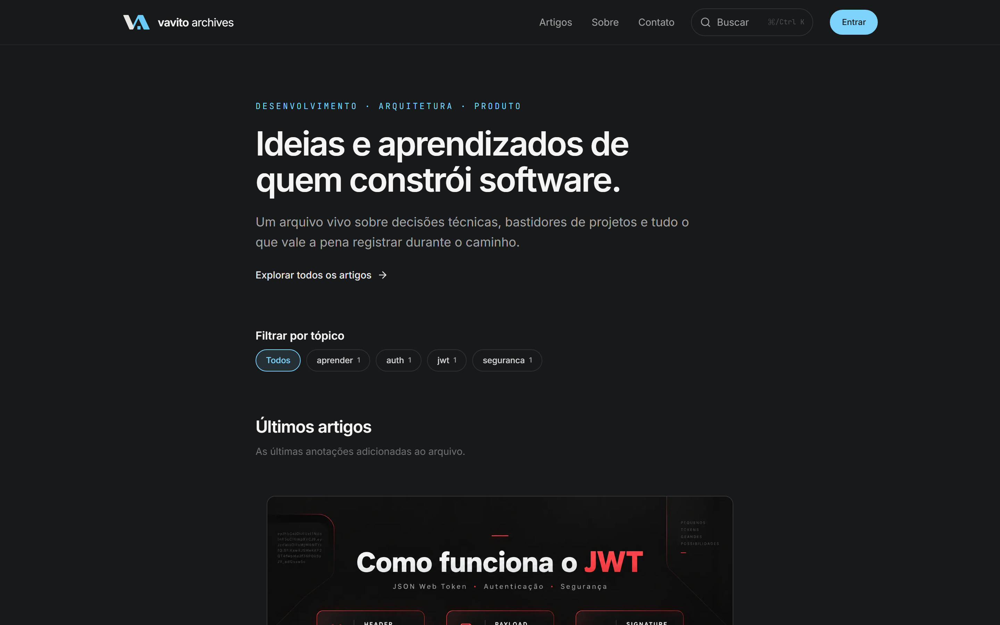
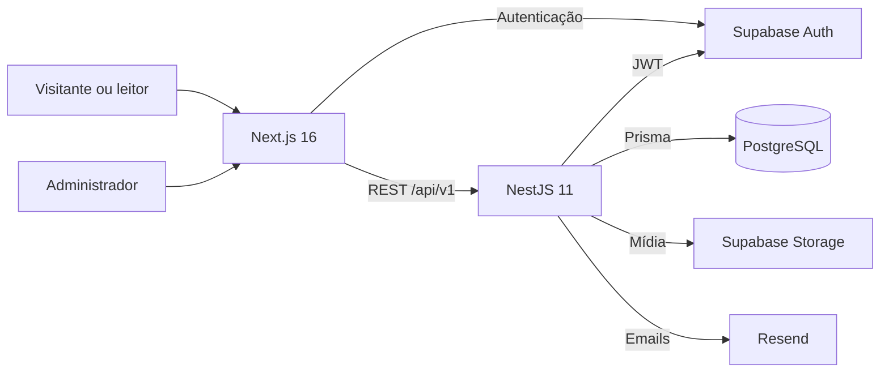

<p align="center">
  <a href="https://vavitoarchives.com.br">
    
  </a>
</p>

<h1 align="center">Vavito Archives</h1>

<p align="center">
  <strong>Ideias e aprendizados de quem constrói software.</strong><br />
  Uma plataforma editorial completa para publicar, descobrir e acompanhar conteúdo sobre desenvolvimento, arquitetura e produto.
</p>

<p align="center">
  <a href="https://vavitoarchives.com.br"><strong>Acessar o site</strong></a>
  ·
  <a href="https://vavitoarchives.com.br/artigos">Explorar artigos</a>
  ·
  <a href="./docs/product/v1-scope.md">Conhecer o produto</a>
</p>

<p align="center">
  <a href="https://github.com/vavito/vavito_archives/actions/workflows/quality.yml">
    
  </a>
</p>



## Sobre o projeto

O **Vavito Archives** transforma experiências reais de construção de software em um arquivo editorial vivo. O produto combina uma experiência pública de leitura com recursos para leitores autenticados e um painel de administração que concentra publicação, comunidade e newsletter.

O projeto foi construído como um produto full stack de ponta a ponta: identidade visual própria, experiência responsiva, fluxo editorial com revisões, autenticação, mídia, comentários, campanhas de email, observabilidade e deploy contínuo.

## Experiência do produto

- **Publicação editorial:** editor rico, capas, imagens, tópicos, preview e revisões independentes da versão publicada.
- **Descoberta de conteúdo:** Home editorial, listagem, busca, filtros, artigos relacionados e métricas de leitura.
- **Comunidade:** contas de leitor, comentários, reações, artigos salvos, perfil e moderação administrativa.
- **Newsletter:** inscrição automática após confirmação da conta, campanhas com um ou vários artigos e acompanhamento de entrega.
- **Administração:** gestão de artigos, comentários, tópicos públicos e campanhas em uma área protegida por autorização.
- **Experiência e qualidade:** interface responsiva, acessibilidade, estados de loading, SEO técnico e otimizações de performance.

Os requisitos e limites funcionais estão descritos no [escopo da V1](./docs/product/v1-scope.md). As regras e transições de cada domínio ficam em [regras de domínio e estados](./docs/product/domain-rules-and-states.md).

## Arquitetura



O frontend prioriza Server Components e streaming. A API separa domínio, aplicação, persistência e transporte HTTP. O monorepo mantém contratos e configurações compartilhados sem permitir dependências diretas entre as aplicações.

| Camada   | Tecnologia                           | Responsabilidade                                    |
| -------- | ------------------------------------ | --------------------------------------------------- |
| Web      | Next.js, React, Tailwind CSS, Tiptap | Experiência pública, autenticada e administrativa   |
| API      | NestJS, TypeScript, Prisma           | Regras de negócio, segurança e integrações          |
| Dados    | PostgreSQL e Supabase                | Persistência, autenticação e armazenamento de mídia |
| Email    | Resend                               | Mensagens transacionais e campanhas editoriais      |
| Operação | Vercel, Render e GitHub Actions      | Deploy, migrations e gates de qualidade             |

Para detalhes, consulte o [contrato da API](./docs/product/api-contract-v1.md), o [modelo de dados](./docs/product/data-model-v1.md) e a [documentação do cliente HTTP](./docs/development/api-client.md).

## Estrutura do monorepo

```text
apps/
  api/               API NestJS e schema Prisma
  web/               Aplicação Next.js
packages/
  api-client/        Contrato OpenAPI e cliente tipado
  ui/                Design system compartilhado
  eslint-config/     Regras compartilhadas de lint
  typescript-config/ Configurações TypeScript
tests/
  e2e/               Jornadas full stack
docs/
  product/           Produto, domínio e contratos
  development/       Guias técnicos e operacionais
```

## Executar localmente

Requer **Node.js 24 LTS**, Corepack e os serviços externos indicados no arquivo de ambiente de exemplo.

```bash
corepack enable
corepack install
pnpm install
```

Prepare os ambientes locais:

```bash
cp .env.example .env
cp apps/web/.env.example apps/web/.env.local
```

No PowerShell, use `Copy-Item` no lugar de `cp`. Depois de configurar PostgreSQL, Supabase e Resend, aplique as migrations e inicie o monorepo:

```bash
pnpm --filter @vavito/api prisma:migrate:deploy
pnpm dev
```

- Web: `http://localhost:3000`
- API: `http://localhost:3001`
- Swagger em desenvolvimento: `http://localhost:3001/docs`

O procedimento completo, incluindo autenticação e dados de demonstração, está no [guia de execução da API](./docs/development/api-demo.md). O conteúdo técnico anteriormente mantido neste README foi preservado em [documentação técnica arquivada](./docs_personal/README-technical.md).

## Qualidade

```bash
pnpm check                # formatação, lint, tipos, testes e builds
pnpm test:regression:api  # regressão completa da API
pnpm test:web             # componentes e integrações do frontend
pnpm test:e2e:full-stack  # jornadas públicas, autenticadas e administrativas
pnpm security:check       # segredos e vulnerabilidades críticas
```

A estratégia de CI, o PostgreSQL isolado dos testes e os checks obrigatórios estão documentados em [integração contínua](./docs/development/continuous-integration.md). A matriz de proteção está em [segurança, privacidade e go-live](./docs/development/security-privacy-go-live.md).

## Documentação

| Quero entender…                   | Documento                                                                                                    |
| --------------------------------- | ------------------------------------------------------------------------------------------------------------ |
| O produto e o que pertence à V1   | [Escopo do produto](./docs/product/v1-scope.md)                                                              |
| Os termos e conceitos do domínio  | [Linguagem ubíqua](./docs/product/ubiquitous-language-glossary.md)                                           |
| As entidades e relações do banco  | [Modelo de dados](./docs/product/data-model-v1.md)                                                           |
| Endpoints, DTOs e códigos de erro | [Contrato da API](./docs/product/api-contract-v1.md)                                                         |
| Autenticação e sessões            | [Supabase Auth](./docs/development/supabase-auth.md)                                                         |
| Editor e publicação de artigos    | [Editor de artigos](./docs/development/article-editor.md)                                                    |
| Mídia e armazenamento             | [Storage de mídia](./docs/development/media-storage.md)                                                      |
| Emails, newsletter e campanhas    | [Templates](./docs/development/email-templates.md) · [Campanhas](./docs/development/newsletter-campaigns.md) |
| Testes e jornadas do produto      | [E2E full stack](./docs/development/full-stack-e2e.md)                                                       |
| Deploy e operação                 | [Render](./docs/development/render-api.md) · [Release candidate](./docs/development/release-candidate.md)    |

## Deploy

A aplicação web é publicada na **Vercel**, a API na **Render** e os serviços de autenticação, banco e storage ficam no **Supabase**. O pipeline só libera produção depois dos checks obrigatórios e aplica migrations versionadas durante o deploy da API.

Consulte o [guia da Render](./docs/development/render-api.md) e o [runbook de release](./docs/development/release-candidate.md) antes de promover ou reverter uma versão.

---

<p align="center">
  <a href="https://vavitoarchives.com.br">vavitoarchives.com.br</a><br />
  <sub>Registrar o presente. Construir o futuro.</sub>
</p>
