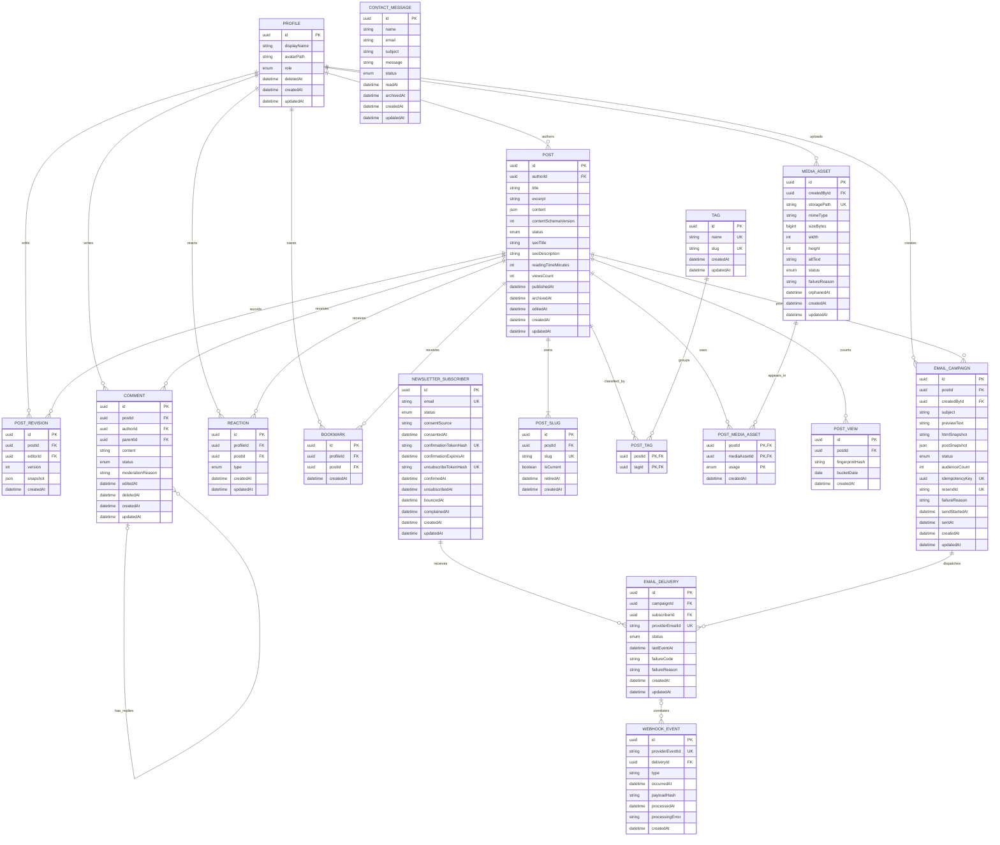

# Vavito Archives — Modelo de dados inicial da V1

Status: **aprovado**

Este documento é o rascunho aprovado antes da criação de `apps/api/prisma/schema.prisma` e da primeira migration. Ele define tabelas, cardinalidades, chaves, índices, ações referenciais e estratégia de exclusão.

## Princípios

- Prisma administra apenas as tabelas da aplicação no schema PostgreSQL `public`.
- Supabase Auth continua responsável por `auth.users`; `Profile.id` usa o mesmo UUID do usuário autenticado.
- Todos os identificadores da aplicação usam UUID.
- Todas as tabelas mutáveis possuem `createdAt` e `updatedAt` quando aplicável.
- Datas usam `timestamptz` e UTC.
- Conteúdo Tiptap e snapshots editoriais usam `JSONB` com versão de schema.
- Estados são enums do PostgreSQL representados por enums equivalentes no Prisma.
- Regras simples e concorrentes são protegidas no banco; regras que dependem de outra linha continuam no domínio/service e recebem testes de integração.
- URLs públicas são derivadas de paths de Storage; chaves secretas e tokens em texto puro nunca são persistidos.

## Visão relacional

O diagrama abaixo é o DER canônico do rascunho. `PK` indica chave primária, `FK` chave estrangeira e `UK` valor único.



### Constraints compostas do DER

O Mermaid identifica os campos, mas não expressa todas as regras compostas com clareza:

- `POST_TAG`: PK `(postId, tagId)`;
- `POST_MEDIA_ASSET`: PK `(postId, mediaAssetId, usage)`;
- `POST_REVISION`: unique `(postId, version)`;
- `REACTION`: unique `(profileId, postId)`;
- `BOOKMARK`: unique `(profileId, postId)`;
- `POST_VIEW`: unique `(postId, fingerprintHash, bucketDate)`;
- `EMAIL_DELIVERY`: unique `(campaignId, subscriberId)`;
- `COMMENT`: o pai usa a combinação `(parentId, postId)` para permanecer no mesmo artigo;
- `POST_SLUG`: índice parcial garante apenas um slug atual por post;
- `POST_MEDIA_ASSET`: índice parcial garante apenas uma capa por post.

## Enums

| Enum | Valores |
| --- | --- |
| `UserRole` | `USER`, `ADMIN` |
| `PostStatus` | `DRAFT`, `PUBLISHED`, `ARCHIVED` |
| `CommentStatus` | `VISIBLE`, `HIDDEN`, `SPAM`, `DELETED` |
| `ReactionType` | `LIKE`, `DISLIKE` |
| `MediaAssetStatus` | `UPLOADING`, `READY`, `FAILED`, `ORPHANED` |
| `MediaUsageType` | `COVER`, `CONTENT` |
| `SubscriberStatus` | `PENDING`, `CONFIRMED`, `UNSUBSCRIBED`, `BOUNCED`, `COMPLAINED` |
| `CampaignStatus` | `DRAFT`, `SENDING`, `SENT`, `FAILED` |
| `EmailDeliveryStatus` | `QUEUED`, `SENT`, `DELIVERED`, `DELIVERY_DELAYED`, `BOUNCED`, `COMPLAINED`, `FAILED`, `SUPPRESSED` |
| `ContactMessageStatus` | `RECEIVED`, `READ`, `ARCHIVED` |

## Tabelas por módulo

### Profile

| Campo | Tipo | Regra |
| --- | --- | --- |
| `id` | UUID | PK; mesmo UUID de `auth.users.id`; sem FK gerenciada pelo Prisma para o schema `auth`. |
| `displayName` | varchar | obrigatório enquanto ativo. |
| `avatarPath` | varchar nullable | path do avatar no bucket apropriado; a URL é derivada. |
| `role` | `UserRole` | padrão `USER`; nunca aceito diretamente do cliente. |
| `deletedAt` | timestamptz nullable | marca exclusão lógica/anônima da conta. |
| `createdAt`, `updatedAt` | timestamptz | auditoria. |

Exclusão de conta é um fluxo transacional: revoga ou remove a identidade no Supabase Auth, remove avatar, apaga reactions/bookmarks, aplica a política definida aos comentários e anonimiza o Profile. Posts e revisões editoriais não são apagados em cascata.

### Post

| Campo | Tipo | Regra |
| --- | --- | --- |
| `id` | UUID | PK. |
| `authorId` | UUID | FK `Profile`; obrigatório. |
| `title` | varchar | pode estar incompleto em `DRAFT`; obrigatório publicado. |
| `excerpt` | text nullable | obrigatório publicado. |
| `content` | JSONB | documento Tiptap. |
| `contentSchemaVersion` | inteiro | versão positiva do documento. |
| `status` | `PostStatus` | padrão `DRAFT`. |
| `seoTitle`, `seoDescription` | varchar/text nullable | metadados públicos opcionais. |
| `readingTimeMinutes` | inteiro | não negativo, recalculado no backend. |
| `viewsCount` | inteiro | não negativo; contador derivado/cached. |
| `publishedAt`, `archivedAt`, `editedAt` | timestamptz nullable | coerentes com o estado. |
| `createdAt`, `updatedAt` | timestamptz | auditoria. |

O slug não fica diretamente em `Post`; ele é resolvido pela linha atual de `PostSlug`. Isso permite que todos os slugs, atuais ou antigos, compartilhem uma única constraint de unicidade.

### PostSlug

| Campo | Tipo | Regra |
| --- | --- | --- |
| `id` | UUID | PK. |
| `postId` | UUID | FK `Post`; cascade. |
| `slug` | varchar | único global após normalização. |
| `isCurrent` | boolean | apenas uma linha atual por post. |
| `retiredAt` | timestamptz nullable | preenchido quando substituído. |
| `createdAt` | timestamptz | auditoria. |

Uma consulta por qualquer slug encontra o post. Se `isCurrent = false`, a API informa ao frontend a URL canônica atual para redirecionamento permanente.

### PostRevision

| Campo | Tipo | Regra |
| --- | --- | --- |
| `id` | UUID | PK. |
| `postId` | UUID | FK `Post`; cascade. |
| `editorId` | UUID | FK `Profile`; restrict. |
| `version` | inteiro | único por post e crescente. |
| `snapshot` | JSONB | estado anterior completo dos campos editáveis, inclusive slug atual e tags. |
| `createdAt` | timestamptz | momento da edição publicada. |

Rascunhos não exigem uma revisão a cada autosave. Uma edição de `PUBLISHED` salva a revisão anterior e atualiza o post na mesma transação.

### Tag e PostTag

`Tag` possui `id`, `name`, `slug`, `createdAt` e `updatedAt`. `name` normalizado e `slug` são únicos.

`PostTag` usa PK composta `(postId, tagId)`. Ambas as FKs usam cascade porque a linha representa somente associação.

### MediaAsset e PostMediaAsset

`MediaAsset` representa o objeto no Storage:

| Campo | Tipo | Regra |
| --- | --- | --- |
| `id` | UUID | PK. |
| `createdById` | UUID | FK `Profile`; restrict. |
| `storagePath` | varchar | único. |
| `mimeType` | varchar | MIME real validado. |
| `sizeBytes` | bigint | positivo. |
| `width`, `height` | inteiro nullable | dimensões quando aplicáveis. |
| `altText` | text | obrigatório e normalizado. |
| `status` | `MediaAssetStatus` | ciclo `UPLOADING/READY/FAILED/ORPHANED`. |
| `failureReason` | text nullable | obrigatório em `FAILED`. |
| `orphanedAt` | timestamptz nullable | obrigatório em `ORPHANED`. |
| `createdAt`, `updatedAt` | timestamptz | auditoria. |

`PostMediaAsset` é a associação muitos-para-muitos:

| Campo | Tipo | Regra |
| --- | --- | --- |
| `postId`, `mediaAssetId`, `usage` | chaves | PK composta. |
| `usage` | `MediaUsageType` | `COVER` ou `CONTENT`. |
| `createdAt` | timestamptz | auditoria. |

Um asset pode ser reutilizado por mais de um post. Apenas uma associação `COVER` é permitida por post. Um asset só se torna órfão quando não aparece em nenhuma associação.

Avatar não reutiliza `MediaAsset`: pertence ao próprio Profile, usa limite e autorização diferentes e não entra na limpeza de mídia editorial.

### Comment

| Campo | Tipo | Regra |
| --- | --- | --- |
| `id` | UUID | PK. |
| `postId` | UUID | FK `Post`; restrict. |
| `authorId` | UUID nullable | FK `Profile`; pode virar nulo após anonimização definitiva. |
| `parentId` | UUID nullable | FK para comentário principal do mesmo post. |
| `content` | text nullable | obrigatório exceto em `DELETED`. |
| `status` | `CommentStatus` | inicia `VISIBLE`. |
| `moderationReason` | text nullable | administrativo. |
| `editedAt`, `deletedAt` | timestamptz nullable | auditoria. |
| `createdAt`, `updatedAt` | timestamptz | auditoria. |

A FK composta `(parentId, postId) -> Comment(id, postId)` impede resposta ligada a comentário de outro artigo. A proibição de terceiro nível depende da leitura do pai e é aplicada pelo service dentro da transação.

Soft delete altera `status`, limpa ou substitui `content`, define `deletedAt` e preserva a linha para manter respostas.

### Reaction e Bookmark

`Reaction` possui `id`, `profileId`, `postId`, `type`, `createdAt` e `updatedAt`, com unique `(profileId, postId)`.

`Bookmark` possui `id`, `profileId`, `postId` e `createdAt`, com unique `(profileId, postId)`.

Ambas usam cascade ao excluir fisicamente Profile ou Post. A exclusão de conta remove esses vínculos privados.

### PostView

| Campo | Tipo | Regra |
| --- | --- | --- |
| `id` | UUID | PK. |
| `postId` | UUID | FK `Post`; cascade. |
| `fingerprintHash` | varchar | hash técnico não reversível; nunca IP ou user-agent puros. |
| `bucketDate` | date | janela diária para deduplicação. |
| `createdAt` | timestamptz | auditoria operacional. |

Unique `(postId, fingerprintHash, bucketDate)` impede múltiplas contagens do mesmo sinal técnico no mesmo dia. Os registros técnicos são removidos após **30 dias** por um job de retenção; `Post.viewsCount` permanece consolidado e não é reduzido pela limpeza.

### NewsletterSubscriber

| Campo | Tipo | Regra |
| --- | --- | --- |
| `id` | UUID | PK. |
| `email` | varchar | lowercase normalizado e único. |
| `status` | `SubscriberStatus` | ciclo aprovado. |
| `consentSource` | varchar | origem declarada no contrato. |
| `consentedAt` | timestamptz | obrigatório. |
| `confirmationTokenHash` | varchar nullable | único enquanto ativo. |
| `confirmationExpiresAt` | timestamptz nullable | exigido em `PENDING`. |
| `unsubscribeTokenHash` | varchar | único. |
| `confirmedAt`, `unsubscribedAt`, `bouncedAt`, `complainedAt` | timestamptz nullable | coerentes com o estado. |
| `createdAt`, `updatedAt` | timestamptz | auditoria. |

O email não é associado ao `Profile`: newsletter funciona para visitantes e possui consentimento independente da conta.

### EmailCampaign

| Campo | Tipo | Regra |
| --- | --- | --- |
| `id` | UUID | PK. |
| `postId` | UUID | FK `Post`; restrict. |
| `createdById` | UUID | FK `Profile`; restrict. |
| `subject`, `previewText` | texto | conteúdo editorial. |
| `htmlSnapshot` | text | corpo congelado para envio. |
| `postSnapshot` | JSONB | dados do artigo usados na campanha. |
| `status` | `CampaignStatus` | ciclo aprovado. |
| `audienceCount` | inteiro | quantidade congelada no início do envio. |
| `idempotencyKey` | UUID nullable | único quando o envio inicia. |
| `resendId` | varchar nullable | identificador do provedor, único quando presente. |
| `failureReason` | text nullable | obrigatório em `FAILED`. |
| `sendStartedAt`, `sentAt` | timestamptz nullable | auditoria. |
| `createdAt`, `updatedAt` | timestamptz | auditoria. |

### EmailDelivery

Uma campanha é global, mas entrega, bounce e complaint pertencem a um destinatário. `EmailDelivery` guarda essa separação.

| Campo | Tipo | Regra |
| --- | --- | --- |
| `id` | UUID | PK. |
| `campaignId` | UUID | FK `EmailCampaign`; cascade. |
| `subscriberId` | UUID | FK `NewsletterSubscriber`; restrict. |
| `providerEmailId` | varchar nullable | único quando o Resend fornece o ID. |
| `status` | `EmailDeliveryStatus` | último estado conhecido. |
| `lastEventAt` | timestamptz nullable | ordena webhooks fora de ordem. |
| `failureCode`, `failureReason` | text nullable | diagnóstico seguro. |
| `createdAt`, `updatedAt` | timestamptz | auditoria. |

Unique `(campaignId, subscriberId)` impede duplicar o destinatário na mesma campanha.

### WebhookEvent

| Campo | Tipo | Regra |
| --- | --- | --- |
| `id` | UUID | PK. |
| `providerEventId` | varchar | único; usado para idempotência. |
| `deliveryId` | UUID nullable | FK `EmailDelivery`; set null se a entrega for removida. |
| `type` | varchar | nome do evento Resend. |
| `occurredAt` | timestamptz | data informada pelo provedor. |
| `payloadHash` | varchar | prova técnica sem persistir payload completo desnecessário. |
| `processedAt` | timestamptz nullable | processamento concluído. |
| `processingError` | text nullable | erro sanitizado para retry. |
| `createdAt` | timestamptz | recepção local. |

O payload bruto só existe durante a verificação/processamento, salvo necessidade operacional futura aprovada com política de retenção.

### ContactMessage

| Campo | Tipo | Regra |
| --- | --- | --- |
| `id` | UUID | PK. |
| `name`, `email`, `subject`, `message` | texto | dados validados do formulário. |
| `status` | `ContactMessageStatus` | padrão `RECEIVED`. |
| `readAt`, `archivedAt` | timestamptz nullable | auditoria administrativa. |
| `createdAt`, `updatedAt` | timestamptz | auditoria. |

Mensagens são arquivadas, não apagadas pela operação comum. A política de retenção/LGPD poderá removê-las fisicamente por job auditado.

## Constraints e índices essenciais

### Uniques

- `PostSlug.slug`.
- `Tag.name` normalizado e `Tag.slug`.
- `MediaAsset.storagePath`.
- `Reaction(profileId, postId)`.
- `Bookmark(profileId, postId)`.
- `PostTag(postId, tagId)`.
- `PostMediaAsset(postId, mediaAssetId, usage)`.
- `PostRevision(postId, version)`.
- `PostView(postId, fingerprintHash, bucketDate)`.
- `NewsletterSubscriber.email` normalizado.
- hashes ativos de confirmação e cancelamento.
- `EmailCampaign.idempotencyKey` e `EmailCampaign.resendId` quando preenchidos.
- `EmailDelivery(campaignId, subscriberId)` e `providerEmailId` quando preenchido.
- `WebhookEvent.providerEventId`.

### Índices de consulta

- `Post(status, publishedAt desc, id)` para listagem recente.
- `Post(status, viewsCount desc, id)` para mais acessados.
- índice de busca PostgreSQL para título, excerpt e tags, detalhado na Task 4.7.
- `PostSlug(postId, isCurrent)`.
- `Comment(postId, parentId, createdAt, id)` e `Comment(status, createdAt)`.
- `Reaction(postId, type)` para contadores.
- `Bookmark(profileId, createdAt desc, id)`.
- `MediaAsset(status, orphanedAt)`.
- `NewsletterSubscriber(status, createdAt, id)`.
- `EmailCampaign(status, createdAt, id)`.
- `EmailDelivery(campaignId, status)` e `EmailDelivery(subscriberId, createdAt)`.
- `ContactMessage(status, createdAt, id)`.

### Checks

- contadores, dimensões, bytes, reading time, versão e audiência não podem ser negativos;
- `Comment.content` é obrigatório salvo quando `status = DELETED`;
- datas obrigatórias acompanham o estado de Post, MediaAsset, Subscriber e Campaign;
- `PostSlug.retiredAt` é nulo apenas para o slug atual;
- somente asset `READY` pode ser associado a post, validado no service e rechecado em transação;
- `EmailDelivery.lastEventAt` impede que evento antigo reverta um estado mais recente.

Alguns checks condicionais e índices parciais serão adicionados na migration SQL quando não forem expressáveis diretamente no schema Prisma.

## Ações referenciais

| Relação | Ação proposta | Motivo |
| --- | --- | --- |
| `Profile -> Post` | `Restrict` | conteúdo editorial não desaparece com conta. |
| `Profile -> PostRevision` | `Restrict` | preservar auditoria. |
| `Profile -> Comment` | `SetNull` em purge físico | preservar thread já anonimizada. |
| `Profile -> Reaction/Bookmark` | `Cascade` | vínculos privados somem com a conta. |
| `Post -> PostSlug/PostRevision/PostTag/PostMediaAsset/PostView` | `Cascade` | filhos sem significado independente. |
| `Post -> Comment` | `Restrict` | post que recebeu comentários não é apagado fisicamente. |
| `Post -> Reaction/Bookmark` | `Cascade` | permitido apenas no raro purge físico elegível. |
| `Post -> EmailCampaign` | `Restrict` | campanha enviada preserva referência histórica. |
| `Tag -> PostTag` | `Cascade` | associação sem vida própria. |
| `MediaAsset -> PostMediaAsset` | `Restrict` | asset referenciado não pode ser removido. |
| `Comment -> replies` | `Restrict` | usa soft delete e preserva conversa. |
| `EmailCampaign -> EmailDelivery` | `Cascade` somente antes de envio | campanha enviada não é apagada pela aplicação. |
| `Subscriber -> EmailDelivery` | `Restrict` | histórico de consentimento e entrega. |
| `EmailDelivery -> WebhookEvent` | `SetNull` | evento técnico pode sobreviver à limpeza da entrega. |

## Soft delete, arquivamento e purge

| Recurso | Estratégia V1 |
| --- | --- |
| `Profile` | `deletedAt` + anonimização; não apagar autoria editorial. |
| `Post` | `ARCHIVED`; purge físico apenas de `DRAFT` sem dependências protegidas. |
| `Comment` | `DELETED`, `deletedAt` e placeholder; nunca apagar durante moderação comum. |
| `MediaAsset` | `ORPHANED` antes do purge; revalidar associações imediatamente antes de remover. |
| `Subscriber` | estados de consentimento/supressão; retenção conforme privacidade, sem apagar histórico necessário silenciosamente. |
| `EmailCampaign/EmailDelivery` | imutáveis para exclusão depois do envio; retenção operacional documentada. |
| `ContactMessage` | `ARCHIVED`; purge por política de retenção auditada. |
| joins, reactions e bookmarks | exclusão física controlada. |
| `PostView` | exclusão física automática após 30 dias; o total consolidado permanece em `Post.viewsCount`. |

## Constraints que exigem atenção na migration

1. Índice único parcial para existir somente um `PostSlug.isCurrent = true` por post.
2. Índice único parcial para existir somente um `PostMediaAsset.usage = COVER` por post.
3. FK composta que garante que `Comment.parentId` pertence ao mesmo `postId`.
4. Checks de coerência entre estado e timestamps.
5. Normalização consistente antes das uniques de email, slug e tag.
6. Índice de busca PostgreSQL compatível com a query da Task 4.7.

## Rascunho Prisma dos pontos críticos

Este trecho é estrutural. A Task 2.3 criará o schema completo e a migration SQL complementar.

```prisma
model PostSlug {
  id        String    @id @default(uuid()) @db.Uuid
  postId    String    @db.Uuid
  slug      String    @unique
  isCurrent Boolean   @default(true)
  retiredAt DateTime? @db.Timestamptz(3)
  createdAt DateTime  @default(now()) @db.Timestamptz(3)

  post Post @relation(fields: [postId], references: [id], onDelete: Cascade)

  @@index([postId, isCurrent])
}

model PostRevision {
  id        String   @id @default(uuid()) @db.Uuid
  postId    String   @db.Uuid
  editorId  String   @db.Uuid
  version   Int
  snapshot  Json     @db.JsonB
  createdAt DateTime @default(now()) @db.Timestamptz(3)

  post   Post    @relation(fields: [postId], references: [id], onDelete: Cascade)
  editor Profile @relation(fields: [editorId], references: [id], onDelete: Restrict)

  @@unique([postId, version])
  @@index([postId, createdAt])
}

model Reaction {
  id        String       @id @default(uuid()) @db.Uuid
  profileId String       @db.Uuid
  postId    String       @db.Uuid
  type      ReactionType
  createdAt DateTime     @default(now()) @db.Timestamptz(3)
  updatedAt DateTime     @updatedAt @db.Timestamptz(3)

  @@unique([profileId, postId])
  @@index([postId, type])
}

model Bookmark {
  id        String   @id @default(uuid()) @db.Uuid
  profileId String   @db.Uuid
  postId    String   @db.Uuid
  createdAt DateTime @default(now()) @db.Timestamptz(3)

  @@unique([profileId, postId])
  @@index([profileId, createdAt, id])
}
```

## Decisões aprovadas

1. Slugs atuais e antigos ficam em `PostSlug`, garantindo unicidade global e redirecionamento permanente.
2. Uma mídia pode aparecer em vários posts por `PostMediaAsset`; avatar permanece separado.
3. Edição de post publicado cria `PostRevision` com snapshot completo da versão anterior.
4. Exclusão de conta anonimiza Profile e preserva autoria/histórico; reactions e bookmarks são removidos.
5. `PostView` guarda apenas hash técnico diário para deduplicar visualizações e possui retenção de 30 dias; o público recebe somente `Post.viewsCount`.
6. `EmailDelivery` separa o estado individual do estado global da campanha; `WebhookEvent` garante idempotência.
7. Mensagens de contato e campanhas enviadas são arquivadas/retidas, não apagadas pela operação comum.
8. Índices parciais, checks condicionais e a FK composta de comentários podem exigir SQL complementar na migration.

## Critérios de validação

- Toda tabela possui dono de módulo e finalidade definida.
- Cardinalidades suportam o contrato da API sem relações implícitas.
- Uniques protegem concorrência em slug, reaction, bookmark, inscrição e envio.
- Slug antigo, revisão publicada e webhook idempotente possuem persistência explícita.
- Exclusões não apagam conteúdo editorial ou threads acidentalmente.
- Mídia órfã pode ser identificada por ausência real de associações.
- O rascunho é suficiente para a Task 2.3 produzir um schema compilável e uma migration revisável.

## Referências

- `docs/product/v1-scope.md`
- `docs/product/domain-rules-and-states.md`
- `docs/product/api-contract-v1.md`
- `docs_personal/plano_execucao_vavito_archives.html`
- Notion: `Task 0.4 — Desenhar modelo de dados inicial`
