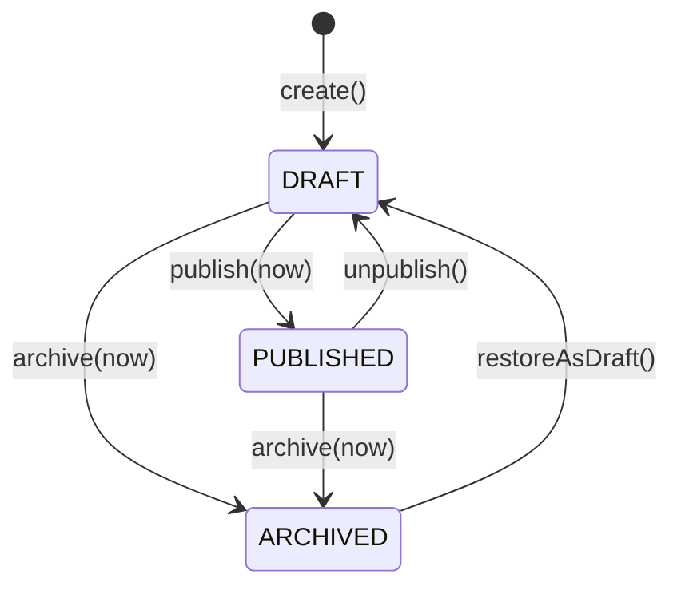
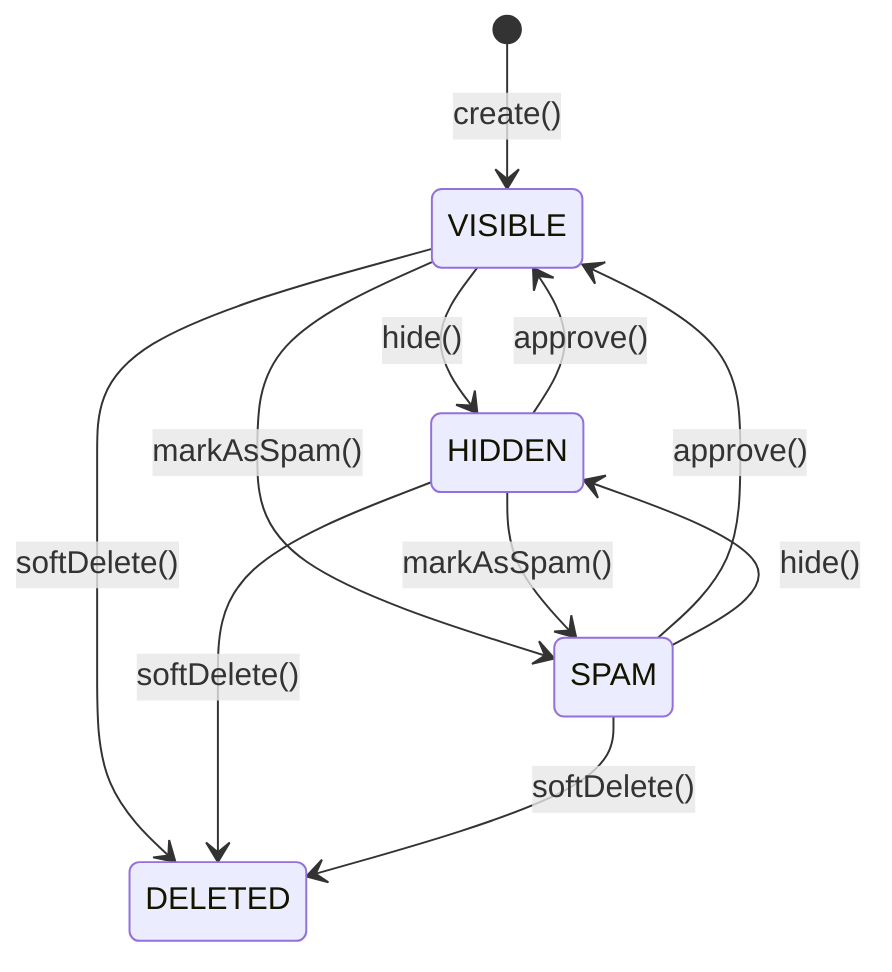
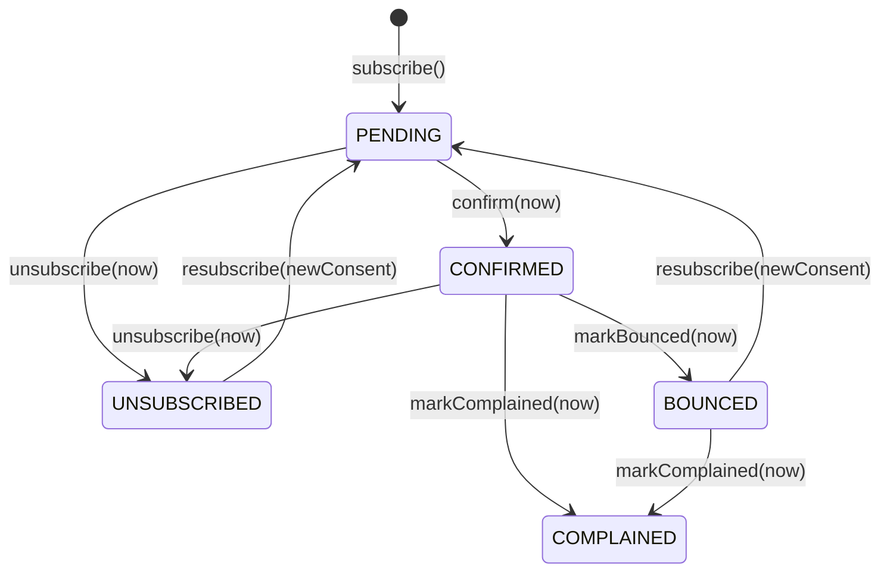
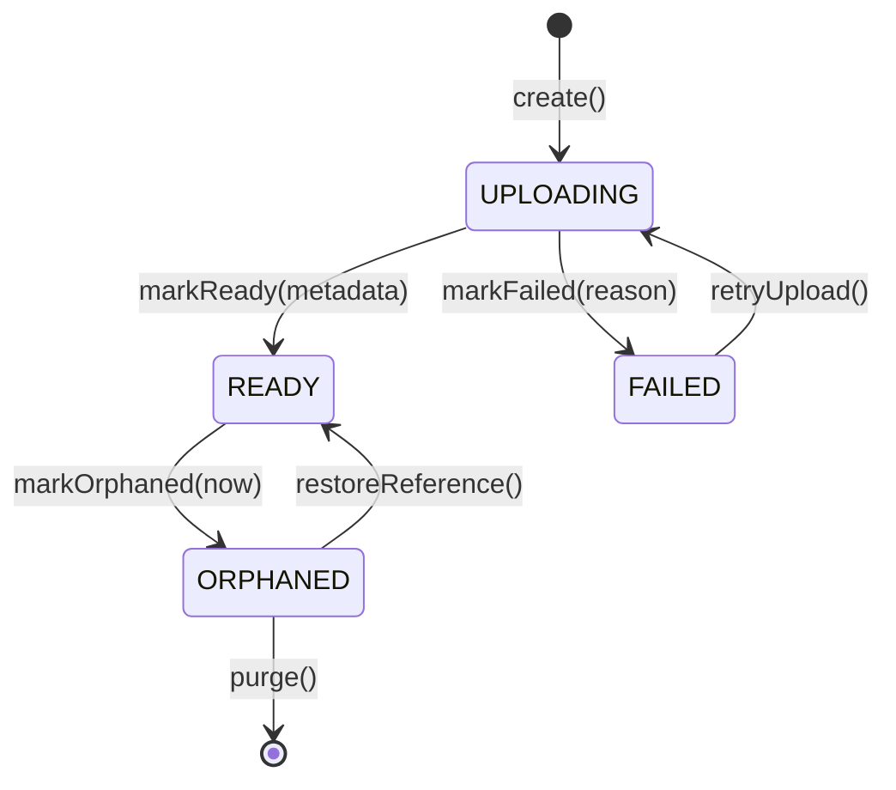
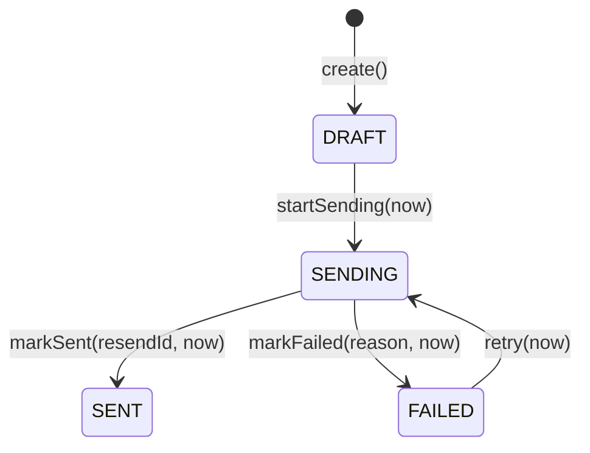

# Vavito Archives — Regras de domínio e estados

Status: **aprovado**

Este documento define os estados, transições, invariantes e erros de domínio de `Post`, `Comment`, `Subscriber`, `MediaAsset` e `EmailCampaign` na V1. Ele é a referência para entidades, services, banco, API e testes.

## Convenções

- Uma transição é executada por um método com nome de negócio, nunca por `updateStatus()`.
- A entidade valida estado atual, dados próprios e invariantes locais.
- O service valida autorização, unicidade, existência de outras entidades e integrações externas.
- Transição inválida gera erro de domínio estável e não altera parcialmente a entidade.
- Persistência e efeitos externos acontecem somente depois que a transição de domínio é válida.
- Repetição técnica de uma requisição pode ser tratada como idempotente pelo service, mas não autoriza uma transição de domínio proibida.
- Datas são recebidas pela entidade, por exemplo `publish(now)`, para permitir testes determinísticos.

## Post

### Estados

| Estado | Significado | Público |
| --- | --- | --- |
| `DRAFT` | Conteúdo em preparação e editável. | Não |
| `PUBLISHED` | Conteúdo validado, editável com histórico e disponível pela URL pública. | Sim |
| `ARCHIVED` | Conteúdo retirado do fluxo editorial e não editável. | Não |

### Diagrama

### Transições

| Ação | Origem | Destino | Condições |
| --- | --- | --- | --- |
| `create()` | inexistente | `DRAFT` | Autor válido; título e conteúdo podem começar incompletos. |
| `edit(changes, now)` | `DRAFT` | `DRAFT` | Alterações válidas; atualiza `updatedAt`; ainda não exige registro de revisão editorial. |
| `edit(changes, now)` | `PUBLISHED` | `PUBLISHED` | Alterações válidas; service salva uma revisão do conteúdo anterior, define `editedAt = now` e publica a nova versão de forma atômica. |
| `publish(now)` | `DRAFT` | `PUBLISHED` | Título, resumo, slug e conteúdo válidos; conteúdo não vazio; schema do Tiptap suportado; slug único verificado pelo service; `publishedAt = now`. |
| `unpublish()` | `PUBLISHED` | `DRAFT` | Ação administrativa explícita; remove o post da área pública; limpa `publishedAt`. |
| `archive(now)` | `DRAFT` | `ARCHIVED` | Ação administrativa explícita; define `archivedAt = now`. |
| `archive(now)` | `PUBLISHED` | `ARCHIVED` | Ação administrativa explícita; retira o post da área pública; mantém `publishedAt` como histórico e define `archivedAt = now`. |
| `restoreAsDraft()` | `ARCHIVED` | `DRAFT` | Ação administrativa explícita; limpa `publishedAt` e `archivedAt`; nova publicação exigirá validação completa. |

### Invariantes

- Somente `PUBLISHED` pode ser retornado por endpoints públicos.
- `DRAFT` e `PUBLISHED` aceitam alteração de título, resumo, slug, conteúdo, tags, capa e SEO.
- Toda edição de um post `PUBLISHED` preserva uma revisão do estado anterior, autor da alteração e data.
- A edição de um post `PUBLISHED` atualiza o conteúdo público imediatamente após a transação.
- `editedAt` e o histórico de revisões são administrativos; a interface pública não exibe a indicação “editado”.
- `PUBLISHED` exige `publishedAt`, título, resumo, slug e conteúdo válidos.
- `ARCHIVED` exige `archivedAt`.
- Slug é normalizado, não vazio e único; a unicidade é confirmada pelo service/repository.
- Conteúdo possui `schemaVersion` suportada e estrutura Tiptap válida.
- Exclusão permanente não é permitida para `PUBLISHED`.
- Visualizações só são incrementadas para `PUBLISHED`.

### Erros

| Código | Quando ocorre |
| --- | --- |
| `INVALID_POST_STATUS_TRANSITION` | Origem não permite a ação solicitada. |
| `POST_NOT_READY_FOR_PUBLICATION` | Campos obrigatórios ou conteúdo estão incompletos. |
| `POST_CONTENT_INVALID` | JSON ou versão do schema do editor é inválida. |
| `POST_SLUG_INVALID` | Slug vazio ou fora do formato canônico. |
| `SLUG_ALREADY_EXISTS` | Service encontra outro post com o mesmo slug. |
| `POST_EDIT_NOT_ALLOWED` | Tentativa de editar post `ARCHIVED`. |
| `POST_DELETE_NOT_ALLOWED` | Tentativa de excluir permanentemente um post publicado. |

## Comment

### Estados

| Estado | Significado | Visível publicamente |
| --- | --- | --- |
| `VISIBLE` | Publicado imediatamente e exibido no artigo. | Sim |
| `HIDDEN` | Ocultado pela moderação. | Não |
| `SPAM` | Identificado como abuso ou conteúdo indesejado. | Não |
| `DELETED` | Removido logicamente pelo autor ou administrador. | Apenas placeholder quando necessário à conversa |

### Diagrama

### Transições

| Ação | Origem | Destino | Condições |
| --- | --- | --- | --- |
| `create()` | inexistente | `VISIBLE` | Leitor autenticado; post existe e está `PUBLISHED`; conteúdo válido; profundidade máxima respeitada. O comentário aparece sem aprovação prévia. |
| `approve()` | `HIDDEN` ou `SPAM` | `VISIBLE` | Administrador restaura um comentário moderado; comentário não está deletado. |
| `hide()` | `VISIBLE` ou `SPAM` | `HIDDEN` | Administrador; motivo pode ser registrado para auditoria. |
| `markAsSpam()` | `VISIBLE` ou `HIDDEN` | `SPAM` | Administrador; motivo pode ser registrado para auditoria. |
| `edit(content, now)` | `VISIBLE` | `VISIBLE` | Autor; conteúdo válido; define `editedAt = now`; moderação pode ocultar posteriormente. |
| `softDelete(now)` | `VISIBLE`, `HIDDEN` ou `SPAM` | `DELETED` | Autor do comentário ou administrador, validado pelo service; define `deletedAt = now`. |

### Invariantes

- Todo comentário pertence a um post.
- O post precisa estar `PUBLISHED` para aceitar novo comentário.
- O autor é um `Profile` autenticado.
- Todo comentário válido nasce `VISIBLE`; a moderação é posterior à publicação.
- Conteúdo não pode ficar vazio após normalização e respeita limite configurado.
- Conversas possuem dois níveis: comentário principal e respostas diretas.
- `parentId`, quando presente, aponta para comentário principal do mesmo post.
- Uma resposta não pode ser pai de outra resposta.
- Somente `VISIBLE` aparece com conteúdo integral na área pública.
- `DELETED` é terminal e não pode ser editado, aprovado, ocultado ou marcado como spam.
- Edição define `editedAt` e a interface exibe `editado`.
- A notificação por email acontece depois da persistência; falha de email não altera o estado do comentário.

### Erros

| Código | Quando ocorre |
| --- | --- |
| `INVALID_COMMENT_STATUS_TRANSITION` | Estado atual não permite a ação. |
| `COMMENT_CONTENT_INVALID` | Conteúdo vazio ou acima do limite. |
| `COMMENT_EDIT_NOT_ALLOWED` | Autor incorreto ou estado não editável. |
| `COMMENT_ALREADY_DELETED` | Ação solicitada sobre comentário deletado. |
| `COMMENT_PARENT_INVALID` | Pai inexistente, de outro post ou não é comentário principal. |
| `COMMENT_NESTING_LIMIT_EXCEEDED` | Tentativa de criar terceiro nível. |
| `POST_NOT_OPEN_FOR_COMMENTS` | Post não está publicado. |

## Subscriber

O nome canônico da entidade é `Subscriber`; o modelo Prisma pode usar `NewsletterSubscriber` quando necessário para clareza de persistência.

### Estados

| Estado | Significado | Elegível para campanha |
| --- | --- | --- |
| `PENDING` | Consentimento registrado, aguardando double opt-in. | Não |
| `CONFIRMED` | Email confirmado e assinatura ativa. | Sim |
| `UNSUBSCRIBED` | Cancelamento solicitado pelo titular. | Não |
| `BOUNCED` | Provedor informou falha permanente de entrega. | Não |
| `COMPLAINED` | Destinatário marcou a mensagem como spam. | Não |

### Esclarecimento: bounce e reclamação de spam

- `COMPLAINED` significa que o destinatário clicou em “Marcar como spam” no Gmail, Outlook ou outro cliente de email. O provedor envia esse evento por webhook e o endereço deixa de receber campanhas para respeitar a decisão do destinatário e proteger a reputação de envio.
- Limitação conhecida: nem todos os provedores comunicam a reclamação de spam ao Resend. A documentação do Resend informa especificamente que Gmail e Google Workspace não retornam o evento `email.complained`; portanto, a aplicação só pode atualizar o assinante quando o evento for efetivamente recebido.
- `BOUNCED` é usado apenas para falha permanente, por exemplo endereço inexistente, domínio inválido ou caixa que rejeita definitivamente aquela conta.
- Falha temporária, como caixa cheia, timeout ou indisponibilidade momentânea, não altera o estado do assinante. Ela pode ser registrada no histórico de entrega e repetida conforme a política do provedor.

### Diagrama

### Transições

| Ação | Origem | Destino | Condições |
| --- | --- | --- | --- |
| `subscribe(consent, tokenHash)` | inexistente | `PENDING` | Email normalizado; consentimento, origem e data presentes; token armazenado somente como hash. |
| `confirm(token, now)` | `PENDING` | `CONFIRMED` | Token válido, não expirado e correspondente ao hash; define `confirmedAt = now`. |
| `unsubscribe(now)` | `PENDING` ou `CONFIRMED` | `UNSUBSCRIBED` | Token de cancelamento válido; operação repetida é tratada como idempotente pelo service. |
| `markBounced(now)` | `CONFIRMED` | `BOUNCED` | Webhook Resend autêntico e idempotente; define `bouncedAt = now`. |
| `markComplained(now)` | `CONFIRMED` ou `BOUNCED` | `COMPLAINED` | Webhook Resend autêntico e idempotente; define `complainedAt = now`. |
| `resubscribe(consent, tokenHash)` | `UNSUBSCRIBED` ou `BOUNCED` | `PENDING` | Novo consentimento explícito; novo token; limpa datas incompatíveis e exige confirmação novamente. |

### Invariantes

- Email é normalizado e único.
- Consentimento possui data e origem.
- Apenas `CONFIRMED` entra na audiência de campanha.
- `PENDING` exige token de confirmação válido armazenado como hash.
- `CONFIRMED` exige `confirmedAt`.
- `UNSUBSCRIBED` exige `unsubscribedAt`.
- `BOUNCED` exige `bouncedAt`.
- `COMPLAINED` exige `complainedAt` e é terminal na V1.
- Novo consentimento nunca reativa diretamente para `CONFIRMED`.
- Webhooks repetidos não duplicam efeitos.

### Erros

| Código | Quando ocorre |
| --- | --- |
| `INVALID_SUBSCRIBER_STATUS_TRANSITION` | Estado não permite a ação. |
| `SUBSCRIBER_CONSENT_REQUIRED` | Consentimento, data ou origem ausente. |
| `SUBSCRIBER_CONFIRMATION_TOKEN_INVALID` | Token não corresponde ao hash. |
| `SUBSCRIBER_CONFIRMATION_TOKEN_EXPIRED` | Token ultrapassou a validade. |
| `SUBSCRIBER_SUPPRESSED` | Tentativa automática de reativar `COMPLAINED`. |
| `SUBSCRIBER_NOT_ELIGIBLE` | Inclusão em campanha fora de `CONFIRMED`. |

## MediaAsset

Uma mídia órfã é um arquivo que existe no Storage, mas não está referenciado por nenhum post. Isso pode ocorrer quando o administrador faz upload de uma imagem e não a utiliza, substitui uma imagem ou abandona uma edição. O arquivo só pode ser marcado como `ORPHANED` depois de um período de segurança e de uma verificação de referências.

### Estados

| Estado | Significado | Pode ser usado em post |
| --- | --- | --- |
| `UPLOADING` | Registro reservado enquanto o objeto é enviado. | Não |
| `READY` | Objeto e metadados validados. | Sim |
| `FAILED` | Upload ou persistência de metadados falhou. | Não |
| `ORPHANED` | Arquivo pronto sem referência após período de segurança. | Não |

### Diagrama

### Transições

| Ação | Origem | Destino | Condições |
| --- | --- | --- | --- |
| `create()` | inexistente | `UPLOADING` | Administrador; MIME, tamanho e alt text preliminares válidos; path único reservado. |
| `markReady(metadata)` | `UPLOADING` | `READY` | Storage confirmou objeto; path, MIME real, tamanho e alt text válidos. |
| `markFailed(reason)` | `UPLOADING` | `FAILED` | Falha registrada; cleanup de objeto parcial coordenado pelo service. |
| `retryUpload()` | `FAILED` | `UPLOADING` | Nova tentativa explícita; path e tentativa controlados para evitar colisão. |
| `markOrphaned(now)` | `READY` | `ORPHANED` | Nenhuma referência válida e período de segurança encerrado; define `orphanedAt = now`. |
| `restoreReference()` | `ORPHANED` | `READY` | Uma referência válida surgiu antes do purge; limpa `orphanedAt`. |
| `purge()` | `ORPHANED` | removido | Dry run concluído; nova checagem confirma ausência de referências; objeto removido antes do registro. |

### Invariantes

- Path de Storage é único.
- MIME real e extensão precisam ser compatíveis.
- Tamanho respeita o limite configurado.
- Alt text normalizado é obrigatório.
- Apenas `READY` pode ser associado ou renderizado em post.
- `READY` exige objeto existente e metadados completos.
- `FAILED` exige motivo de falha.
- `ORPHANED` exige `orphanedAt` e não pode estar referenciado.
- Purge sempre revalida referências e oferece dry run.

### Erros

| Código | Quando ocorre |
| --- | --- |
| `INVALID_MEDIA_STATUS_TRANSITION` | Estado atual não permite a ação. |
| `MEDIA_METADATA_INVALID` | MIME, extensão, tamanho ou path inválido. |
| `MEDIA_ALT_TEXT_REQUIRED` | Alt text ausente após normalização. |
| `MEDIA_STORAGE_INCONSISTENT` | Estado do banco diverge do objeto no Storage. |
| `MEDIA_NOT_ORPHANED` | Purge solicitado para asset ainda referenciado ou fora de `ORPHANED`. |
| `MEDIA_UPLOAD_RETRY_NOT_ALLOWED` | Retry solicitado fora de `FAILED`. |

## EmailCampaign

### Estados

| Estado | Significado |
| --- | --- |
| `DRAFT` | Campanha criada e ainda editável. |
| `SENDING` | Solicitação de envio em processamento. |
| `SENT` | Provedor aceitou o envio e retornou identificador. |
| `FAILED` | Provedor não aceitou a solicitação de envio. |

`SENT` não significa entrega individual garantida. Depois do aceite, eventos de entrega pertencem a cada destinatário: uma falha permanente ou reclamação de spam atualiza o respectivo `Subscriber` para evitar novos envios inadequados. Falhas temporárias são apenas registradas e não bloqueiam o assinante. Se for necessário histórico detalhado por destinatário, ele será representado por um registro de entrega, não por uma mudança no estado global da campanha.

### Diagrama

### Transições

| Ação | Origem | Destino | Condições |
| --- | --- | --- | --- |
| `create(post, audience)` | inexistente | `DRAFT` | Post está `PUBLISHED`; assunto e conteúdo válidos; audiência contém apenas subscribers confirmados. |
| `updateContent()` | `DRAFT` | `DRAFT` | Assunto, preview e conteúdo válidos; campanha ainda não iniciada. |
| `startSending(now)` | `DRAFT` | `SENDING` | Audiência não vazia; post continua publicado; idempotency key única; define `sendStartedAt = now`. |
| `markSent(resendId, now)` | `SENDING` | `SENT` | Provedor aceitou a solicitação e retornou ID; define `sentAt = now`. |
| `markFailed(reason, now)` | `SENDING` | `FAILED` | Provedor rejeitou ou esgotou retry limitado sem aceitar o envio. |
| `retry(now)` | `FAILED` | `SENDING` | Não existe confirmação de aceite anterior; reutiliza a mesma idempotency key; incrementa tentativa. |

### Invariantes

- Campanha pertence a um único post publicado.
- Conteúdo enviado é snapshot e não muda se o post for editado depois.
- Audiência é formada apenas por `CONFIRMED`.
- `DRAFT` é o único estado editável.
- `SENDING` exige `sendStartedAt` e idempotency key.
- `SENT` exige `resendId` e `sentAt` e é terminal.
- `FAILED` exige motivo e não possui confirmação de aceite do provedor.
- Repetir envio nunca cria uma segunda campanha ou um segundo disparo aceito.
- Webhooks de bounce e complaint não reabrem nem invalidam uma campanha `SENT`.

### Erros

| Código | Quando ocorre |
| --- | --- |
| `INVALID_CAMPAIGN_STATUS_TRANSITION` | Estado atual não permite a ação. |
| `CAMPAIGN_POST_NOT_PUBLISHED` | Post não está publicado ao criar ou iniciar o envio. |
| `CAMPAIGN_AUDIENCE_EMPTY` | Nenhum subscriber elegível. |
| `CAMPAIGN_CONTENT_INVALID` | Assunto, preview ou corpo inválido. |
| `CAMPAIGN_ALREADY_SENT` | Nova tentativa depois de `SENT`. |
| `CAMPAIGN_SEND_IN_PROGRESS` | Novo envio enquanto está `SENDING`. |
| `CAMPAIGN_PROVIDER_REJECTED` | Provedor não aceitou o envio. |

## Responsabilidades fora das entidades

Os seguintes controles pertencem aos services, repositories ou integrações:

- autenticação e autorização de autor ou administrador;
- unicidade de slug, email e paths;
- carregamento do post pai e validação de relacionamentos;
- transações de banco;
- acesso a Prisma, Supabase Storage e Resend;
- rate limiting;
- idempotência de request e webhook;
- envio do email de novo comentário;
- revalidation de cache do frontend;
- tradução de erros de domínio para HTTP.

## Critérios de validação

- Cada estado possui significado operacional.
- Cada transição declara origem, destino e condições.
- Estados terminais e ações idempotentes estão explícitos.
- Toda invariante pode ser coberta por teste unitário ou de integração.
- Cada falha de regra possui código estável.
- Entidades não dependem de NestJS, Prisma, Supabase, Resend ou HTTP.

## Referências

- `docs/product/v1-scope.md`
- `docs_personal/plano_execucao_vavito_archives.html`
- Notion: `Task 0.2 — Definir regras de domínio e estados`
- Resend: `https://resend.com/docs/dashboard/emails/email-suppressions`
